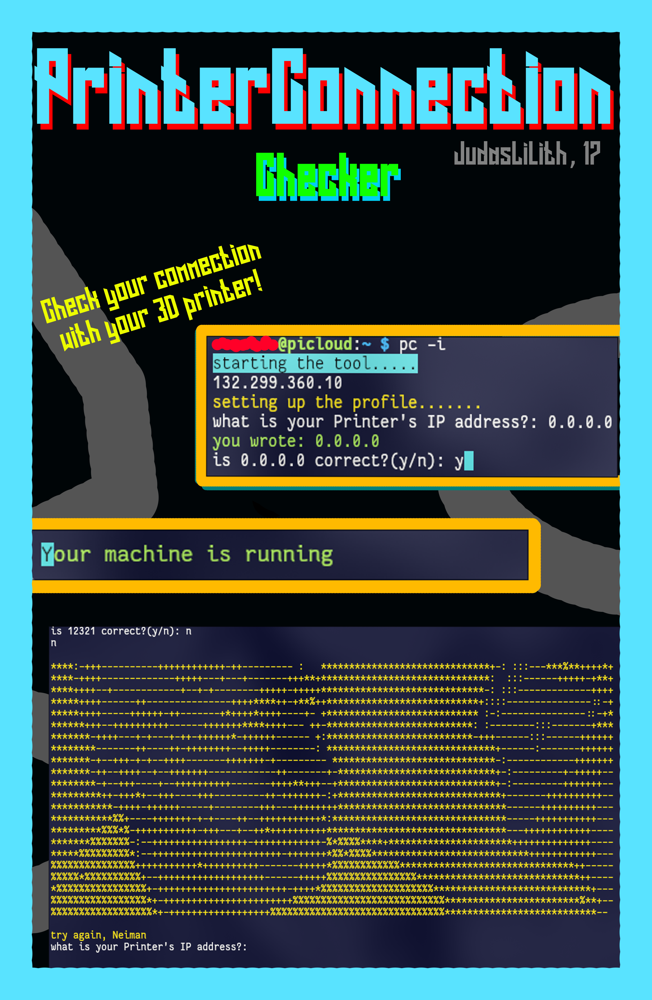

## PrinterConnection

A simple tool to check if your 3D printer is running or not by pinging the server.

### Why did I make this?

This actually started as a way for me to learn developing Nodejs projects and javascript.
I wanted some sort of way for a simple cli application that'll fetch me the
status of my Klipper and OctoPrint setup, for which is accessible through Tailscale VPN.

### dependencies

There are no dependencies and everything got packaged, including the node_modules.
however, you need a working Nodejs, and a Tailscale VPN Client set up first, which you can
do here: [tailscale](https://tailscale.com/)

### Installing

0. I specifically made this program for debian based systems, so be make sure you have apt as your package manager.

1. Download the .deb file from the releases page, or clone this repository with

```bash
git clone https://github.com/JudasLilith/PrinterConnection.git
```

1. now change your directory into the cloned repository,

```bash
cd PrinterConnection
```

1. now install the package with apt:

```bash
sudo apt install prcn-1.0.0.deb
```

1. the program is now installed, and you can now setup the program by calling:

```bash
pc -i
```

1. be sure to plug in the ip for your local machine, so it knows what to ping. if you mess up, you can reset the ip any time!

2. Now, you can check whether or not your printer is working by using the command:

```bash
pc -s
```

#### Have fun using it

#### Credits

- Made for Hack club, YSWS projects. find more about them at: hackclub.com

- inspired by this tutorial: <https://citw.dev/tutorial/create-your-own-cli-tool>

- I am not responsible for any system breaks, I am just a teenager :,(
