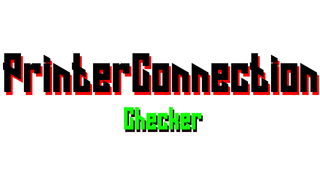

## PrinterConnection

A simple tool to check if your 3D printer is running or not by pinging the server.

### Why did I make this?

This actually started as a way for me to learn developing Nodejs projects and javascript.
I wanted some sort of way for a simple cli application that'll fetch me the
status of my Klipper and OctoPrint setup, for which is accessible through Tailscale VPN.

### dependencies

There are no dependencies and everything got packaged, including the node_modules.
however, you need a working Nodejs, and a Tailscale VPN Client set up first, which you can
do here: [tailscale](https://tailscale.com/)

### Installing

1. Download the .deb file from the releases page, or clone this repository with

```bash
git clone https://github.com/JudasLilith/PrinterConnection.git
```
